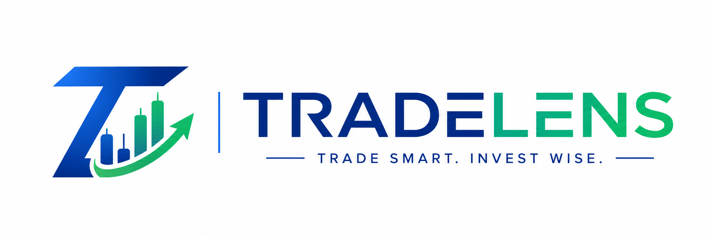
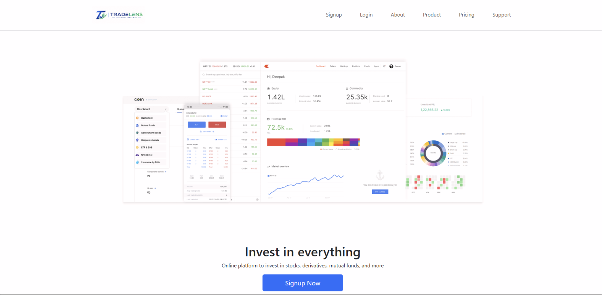
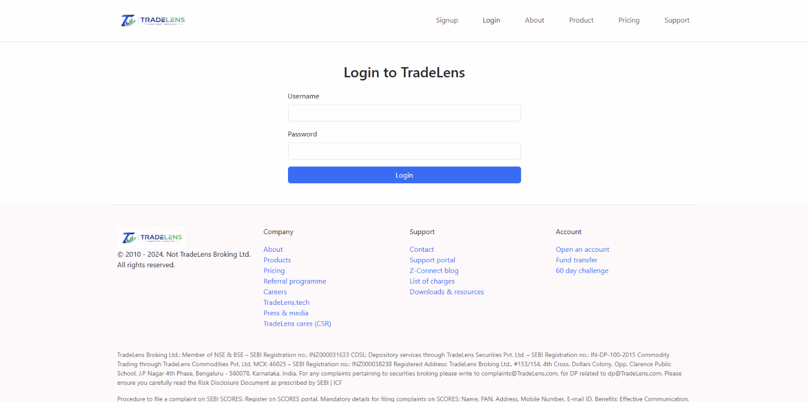
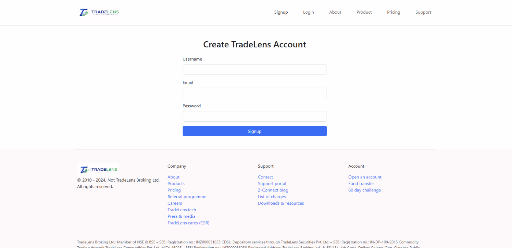
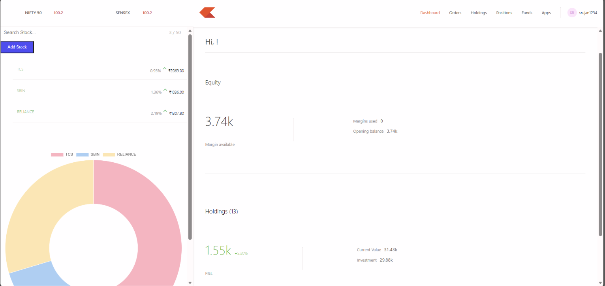
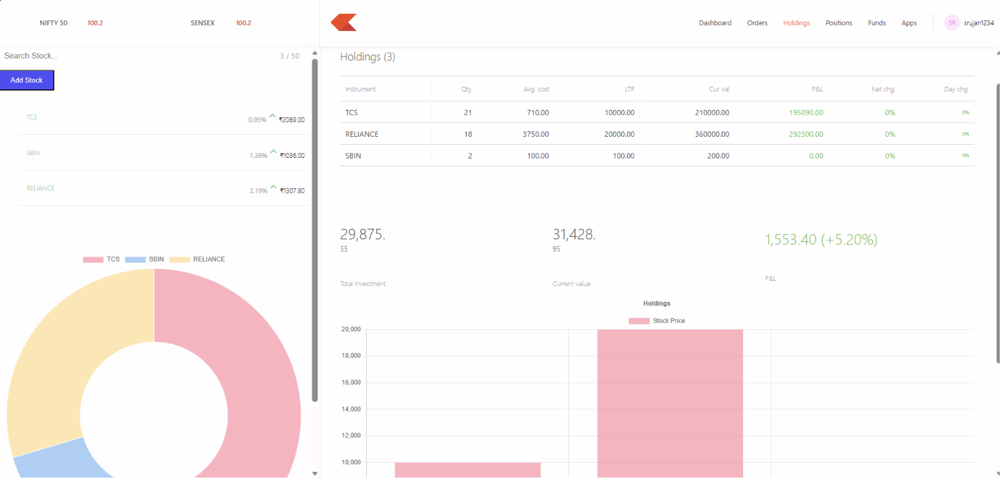
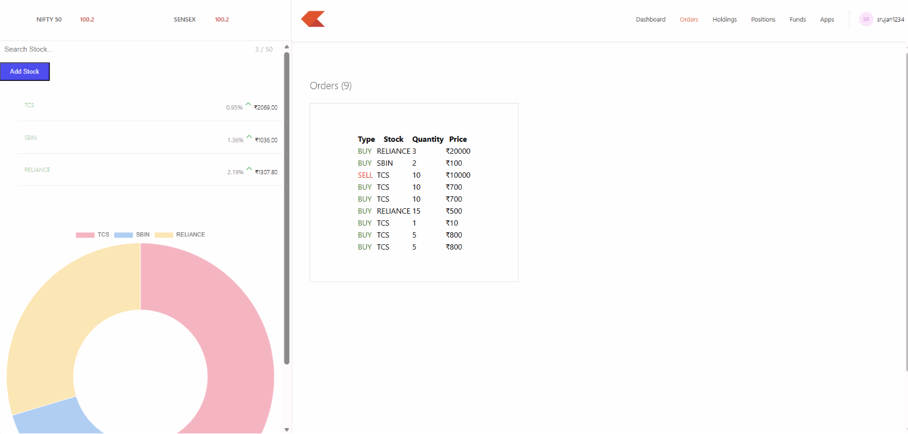
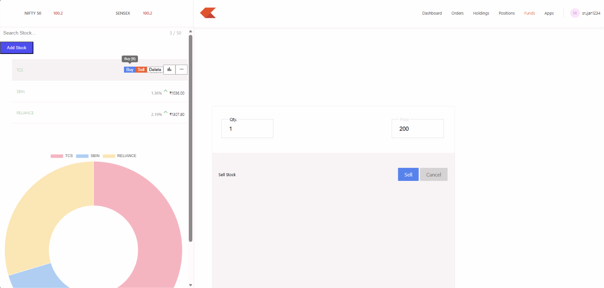

<div align="center">



# 📈 TradeLens

### A Full Stack MERN Stock Trading Platform

TradeLens is a modern stock trading platform inspired by leading brokerage applications. It allows users to securely manage investments, monitor live stock prices, maintain personalized watchlists, and execute virtual buy/sell operations through a responsive dashboard.

<p align="center">

<a href="https://tradelens-1.onrender.com">

</a>

<a href="https://github.com/Srujan-017/TradeLens">

</a>

</p>

<br>


</div>

---

# 🌐 Live Demo

### 🚀 Landing Website

https://tradelens-1.onrender.com


# 📖 About

TradeLens is a **full-stack stock trading platform** built using the **MERN Stack**.

The platform provides a realistic online trading experience where users can:

- Create an account
- Login securely
- Manage their personalized watchlist
- Buy & Sell stocks
- View Holdings
- Monitor Positions
- Track Portfolio
- View live market prices

Real-time stock prices are fetched using the **Yahoo Finance API**, while secure authentication is implemented using **Passport.js**, **Express Sessions**, and **MongoDB Atlas**.

---

# ✨ Features

## 👤 Authentication

- User Registration
- Secure Login
- Password Hashing
- Passport.js Authentication
- Express Session
- Protected Dashboard

---

## 📊 Dashboard

- Portfolio Summary
- Holdings
- Orders
- Positions
- Funds
- Watchlist
- Interactive Charts

---

## 📈 Trading

- Buy Stocks
- Sell Stocks
- Portfolio Management
- Order History

---

## ⭐ Watchlist

- Add Stocks
- Delete Stocks
- Search Stocks
- Auto Suggestions
- Live Market Prices
- Auto Refresh

---

## 📉 Live Market Data

- Yahoo Finance API Integration
- Live Stock Prices
- Price Change
- Percentage Change
- Real-Time Updates

---

## 📊 Data Visualization

- Doughnut Chart
- Holdings Distribution
- Portfolio Visualization

---

# 🛠 Tech Stack

## Frontend

- React.js
- React Router DOM
- Axios
- Bootstrap
- Material UI
- Chart.js

---

## Dashboard

- React.js
- Material UI
- Axios
- Chart.js

---

## Backend

- Node.js
- Express.js
- Passport.js
- Express Session
- Yahoo Finance API

---

## Database

- MongoDB Atlas
- Mongoose

---

# 📂 Project Structure

```
TradeLens
│
├── backend
│   ├── model
│   ├── routes
│   ├── schemas
│   ├── middleware
│   ├── utils
│   └── index.js
│
├── dashboard
│   ├── public
│   ├── src
│   └── package.json
│
├── frontend
│   ├── public
│   ├── src
│   └── package.json
│
├── screenshots
│
└── README.md
```

---

# 📷 Screenshots

## 🏠 Landing Page



---

## 🔐 Login



---

## 📝 Signup



---

## 📊 Dashboard



---

## 💼 Holdings



---

## 📑 Orders



---

## 💸 Buy Window



---

# 🚀 Installation

## Clone Repository

```bash
git clone https://github.com/Srujan-017/TradeLens.git
```

Move into the project

```bash
cd TradeLens
```

---

## Backend Setup

```bash
cd backend
npm install
```

Create:

```
backend/.env
```

Add:

```
MONGO_URL=YOUR_MONGODB_CONNECTION_STRING
PORT=3002
SESSION_SECRET=YOUR_SECRET_KEY
```

Start the backend:

```bash
npm start
```

---

## Frontend Setup

```bash
cd frontend
npm install
npm start
```

---

## Dashboard Setup

```bash
cd dashboard
npm install
npm start
```

---

# 🚀 Deployment

| Service | Platform |
|----------|----------|
| Frontend | Render |
| Dashboard | Render |
| Backend | Render |
| Database | MongoDB Atlas |

---

# 📌 Future Enhancements

- 📈 Live Candlestick Charts
- 🤖 AI Portfolio Advisor
- 📊 Advanced Portfolio Analytics
- 💹 Profit & Loss Reports
- 📰 Financial News Integration
- 🔔 Price Alerts
- 🌙 Dark Mode
- 📱 Mobile Application
- 🌐 Multi-language Support
- 📧 Email Notifications

---

# 👨‍💻 Author

## **Srujan V**

### 🔗 GitHub

https://github.com/Srujan-017

### 💼 LinkedIn

https://www.linkedin.com/in/srujan-v-049560325/

---

# 🙏 Acknowledgements

- Yahoo Finance API
- React.js
- Express.js
- MongoDB Atlas
- Passport.js
- Material UI
- Bootstrap
- Chart.js

---

<div align="center">

## ⭐ If you found this project helpful, please consider giving it a Star on GitHub!

### 🚀 Live Demo

https://tradelens-1.onrender.com

**Thank you for visiting TradeLens!**

</div>

Please consider giving this repository a ⭐ on GitHub!

